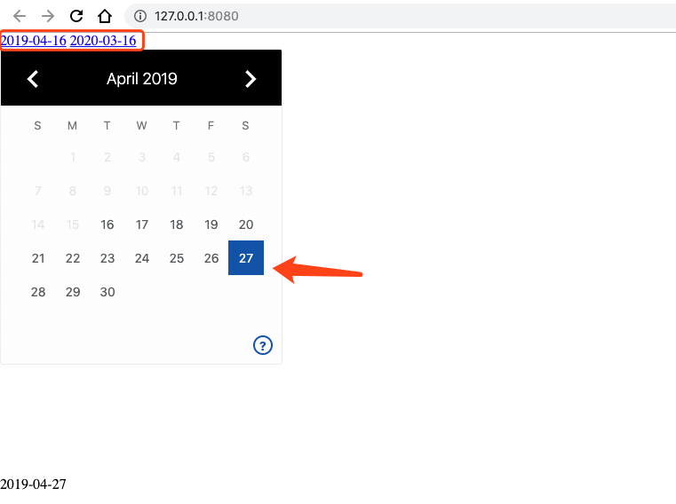

# 想要使用服务端动态限制amp-date-picker的最大和最小时间的选择区间，可以怎么做？

## 解决方案:

使用amp-list的src可以很好地对amp-date-picker的最大最小选择区间进行控制，但是要注意的是，服务端返回的JSON最大最小区间的格式要满足amp-date-picker所需格式。

### 1.服务器返回JSON代码: amp_date_picker.json

```
{
    "items": [
      {
        "max": "2019-04-16",
        "min": "2020-03-16"
      }
    ]
  }
```

### 2.HTML代码: index.html

```
<!doctype html>
<html ⚡>
<head>
  <meta charset="utf-8">
  <title>amp-date-picker</title>
  <script async custom-element="amp-date-picker" src="https://cdn.ampproject.org/v0/amp-date-picker-0.1.js"></script>
  <script async custom-element="amp-bind" src="https://cdn.ampproject.org/v0/amp-bind-0.1.js"></script>
  <script async custom-template="amp-mustache" src="https://cdn.ampproject.org/v0/amp-mustache-0.2.js"></script>
  <script async custom-element="amp-list" src="https://cdn.ampproject.org/v0/amp-list-0.1.js"></script>
  <meta name="viewport" content="width=device-width,minimum-scale=1,initial-scale=1">
  <link rel="canonical" href="http://localhost:8080/documentation/examples/components/amp-date-picker/index.html">
  <style amp-boilerplate>body{-webkit-animation:-amp-start 8s steps(1,end) 0s 1 normal both;-moz-animation:-amp-start 8s steps(1,end) 0s 1 normal both;-ms-animation:-amp-start 8s steps(1,end) 0s 1 normal both;animation:-amp-start 8s steps(1,end) 0s 1 normal both}@-webkit-keyframes -amp-start{from{visibility:hidden}to{visibility:visible}}@-moz-keyframes -amp-start{from{visibility:hidden}to{visibility:visible}}@-ms-keyframes -amp-start{from{visibility:hidden}to{visibility:visible}}@-o-keyframes -amp-start{from{visibility:hidden}to{visibility:visible}}@keyframes -amp-start{from{visibility:hidden}to{visibility:visible}}</style><noscript><style amp-boilerplate>body{-webkit-animation:none;-moz-animation:none;-ms-animation:none;animation:none}</style></noscript>
  <script async src="https://cdn.ampproject.org/v0.js"></script>
  <style amp-custom>
  </style>
</head>
<body>
  <amp-list width="auto"
  height="500"
  layout="fixed-height"
  src="/amp_date_picker.json">
  <template type="amp-mustache">
    <div class="url-entry">
      <a href="{{max}}">{{max}}</a>
      <a href="{{min}}">{{min}}</a>
      <amp-date-picker
        min="{{max}}"
        max="{{min}}"
        id="simple-date-picker-4"
        type="single"
        mode="static"
        layout="fixed-height"
        height="360"
        on="select:AMP.setState({date: event.date ? event.date : ''})"
        locale="en"
        format="YYYY-MM-DD"
        allow-blocked-ranges>
      </amp-date-picker>
    </div>
  </template>
</amp-list>
<div [text]="date">2019-04-19</div>
</body>
</html>
```

##效果如图:

