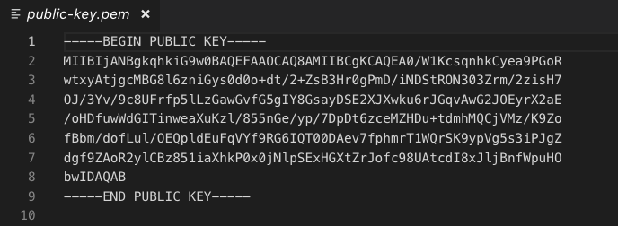
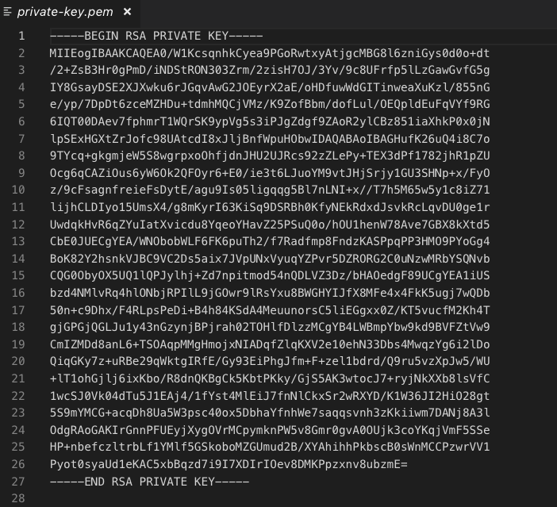
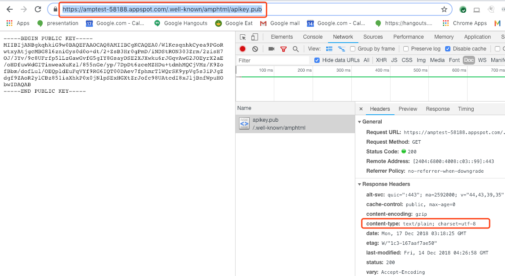
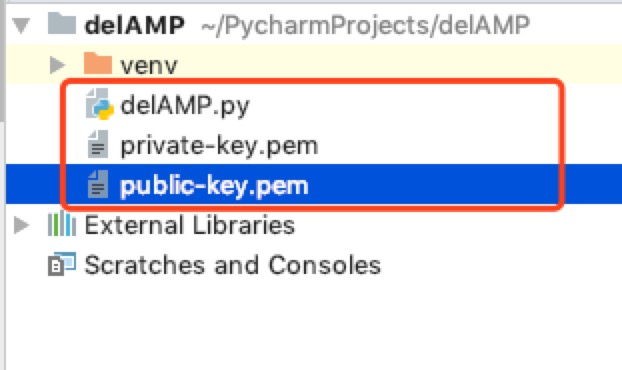

# 使用Python进行AMP内容更新\(Update AMP Content using Python\)

1. 生成一对公钥以及私钥。\(Generate a pair of RSA keys\)
2. 将公钥改名为apikey.pub, 放到服务器中例如以下的结构中: [https://example.com/.well-known/amphtml/apikey.pub](https://example.com/.well-known/amphtml/apikey.pub), 并且response type为"text/plain;charset=UTF-8"。（Rename the public key as apikey.pub, and post the public key on the domain to be refreshed at the following location: "[https://example.com/.well-known/amphtml/apikey.pub"）](https://example.com/.well-known/amphtml/apikey.pub"）)
3. 使用私钥对想要更新的页面进行签名加密并且发送http请求AMP Cache服务器进行AMP页面的更新.\(Sign the AMP url and send the request using http to make a update on AMP Cache Server.\)

## 1. 生成一对公钥以及私钥

```text
// 生成私钥
openssl genrsa 2048 > private-key.pem

// 生成公钥
openssl rsa -in private-key.pem -pubout >public-key.pem
```

应该会得出来一对公钥和私钥，如图：

 

## 2. 将公钥\(public-key.pem\)改名为apikey.pub, 放到服务器中例如以下的结构中

```text
// 对公钥(public-key.pem)进行重命名
mv public-key.pem apikey.pub
```

将apikey.pub放到服务器上面的文件夹下\(/.well-known/amphtml/apikey.pub\)，在浏览器端访问后得到如图的结果: 

## 3. 使用私钥对想要更新的页面进行加密并且发送http请求AMP Cache服务器进行AMP页面的更新

举个栗子: 假如我们要更新的页面是: amptest-58188.appspot.com/delete.html,那么可以根据下面的教程来进行。

* **第一步**:将公钥与私钥\(public key and private key\)粘贴到跟python文件同一个文件夹中，如图：



* **第二步**: 直接粘贴下面的代码，修改下面中的amp\_page\_url为你自己的url地址即可进行AMP页面的更新或者删除。如果不知道怎么拼接，进入到[ampbyexample中输入url地址获取AMP页面地址](https://ampbyexample.com/advanced/using_the_google_amp_cache/)。

```text
import base64
import requests
import subprocess
import time

CACHES_URL = "https://cdn.ampproject.org/caches.json"

# 需要更新或者删除的页面
amp_page_url = "https://amptest-58188.appspot.com/delete.html"

r = requests.get(CACHES_URL)
caches = r.json().get('caches', [])

for cache in caches:
    update_domain = cache.get('updateCacheApiDomainSuffix', None)

    if not update_domain:
        continue

    amp_domain = requests.utils.urlparse(amp_page_url).netloc
    amp_path = requests.utils.urlparse(amp_page_url).path

    update_url_base = "/update-cache/c/s/%s%s?amp_action=flush&amp_ts=%d" % (amp_domain, requests.utils.quote(amp_path), int(time.time()))
    print(update_url_base)

    with open("url.txt","wb") as urltxt:
        urltxt.write(update_url_base.encode('ascii'))

    # 进行签名
    signed_digest_proc = subprocess.Popen(
        ['openssl', 'dgst', '-sha256', '-sign', 'private-key.pem', '-out', 'signature.bin', 'url.txt'],
        stdin=subprocess.PIPE,
        stdout=subprocess.PIPE
    )
    signed_digest_proc.communicate()

    verify_signed_digest_proc = subprocess.Popen(
        ['openssl', 'dgst', '-sha256', '-verify', 'public-key.pem', '-signature', 'signature.bin', 'url.txt'],
        stdin=subprocess.PIPE,
        stdout=subprocess.PIPE
    )
    verify_result, _ = verify_signed_digest_proc.communicate()
    verify_result = verify_result.decode('ascii').strip()

    # 签名验证
    if verify_result != "Verified OK":
        print("Couldn't verify generated signature:", verify_result)
        exit(1)

    update_signature = open("signature.bin","rb").read()

    # 对签名进行urlsafe_base64编码
    update_signature_base64 = base64.urlsafe_b64encode(update_signature)

    final_update_url = "https://%s.%s%s&amp_url_signature=%s" % (amp_domain.replace(".", "-"), update_domain, update_url_base, update_signature_base64)
    print(final_update_url)

    # 进行http请求并且拿取结果
    r2 = requests.get(final_update_url)
    print(r2)
```

* **第三步**: 在命令行中执行python文件并且得出以下结果，如图:


附:

测试地址以及测试地址的公私钥:

1. 测试地址: [https://amptest-58188.appspot.com/delete.html](https://amptest-58188.appspot.com/delete.html)
2. 公钥: [https://amptest-58188.appspot.com/.well-known/amphtml/apikey.pub](https://amptest-58188.appspot.com/.well-known/amphtml/apikey.pub)
3. 私钥: [https://amptest-58188.appspot.com/.well-known/amphtml/privatekey.pem](https://amptest-58188.appspot.com/.well-known/amphtml/privatekey.pem)

假如你不想做那么多步骤，那么你可以直接拿着私钥到[AMP update-cache request](https://amp-cache-refresh.appspot.com/)直接生成想要更新AMP页面的地址，并且请求即可。

