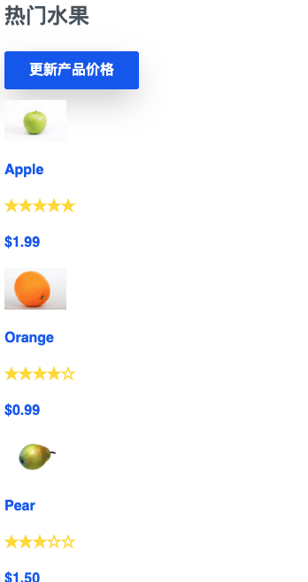
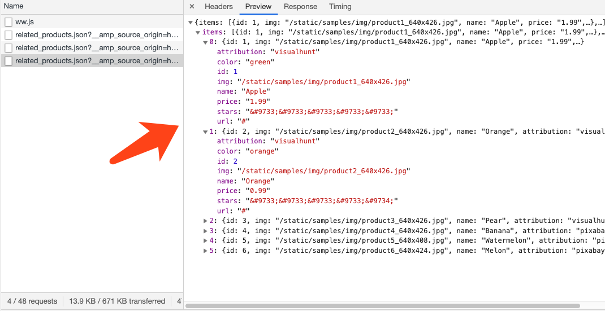
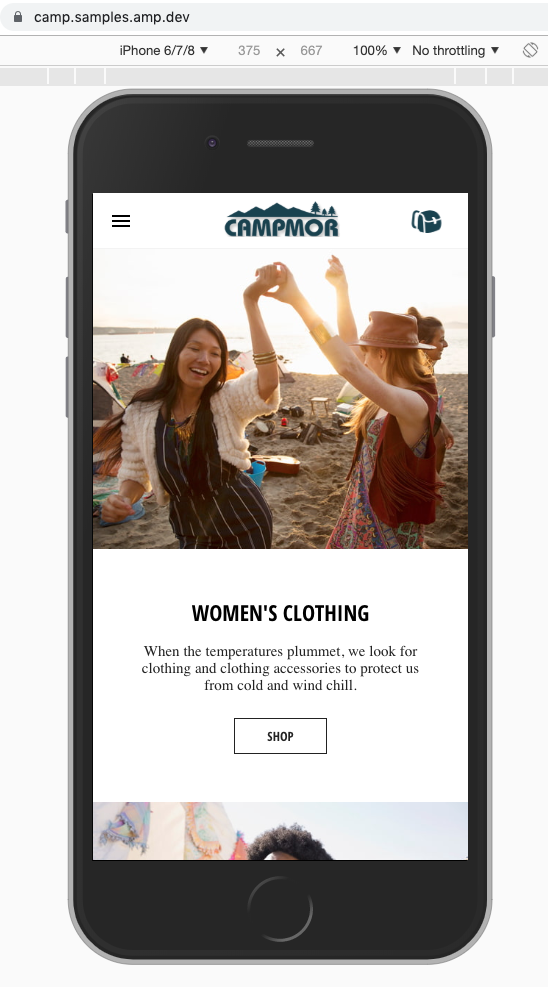
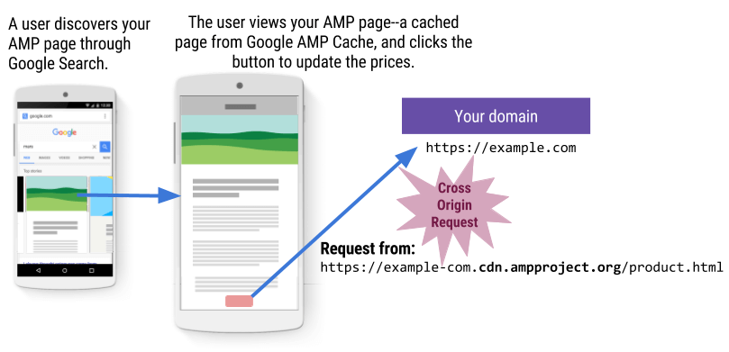
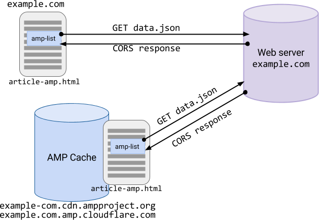
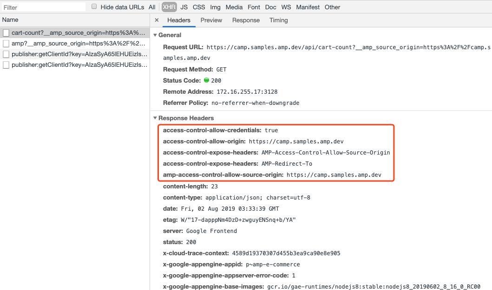
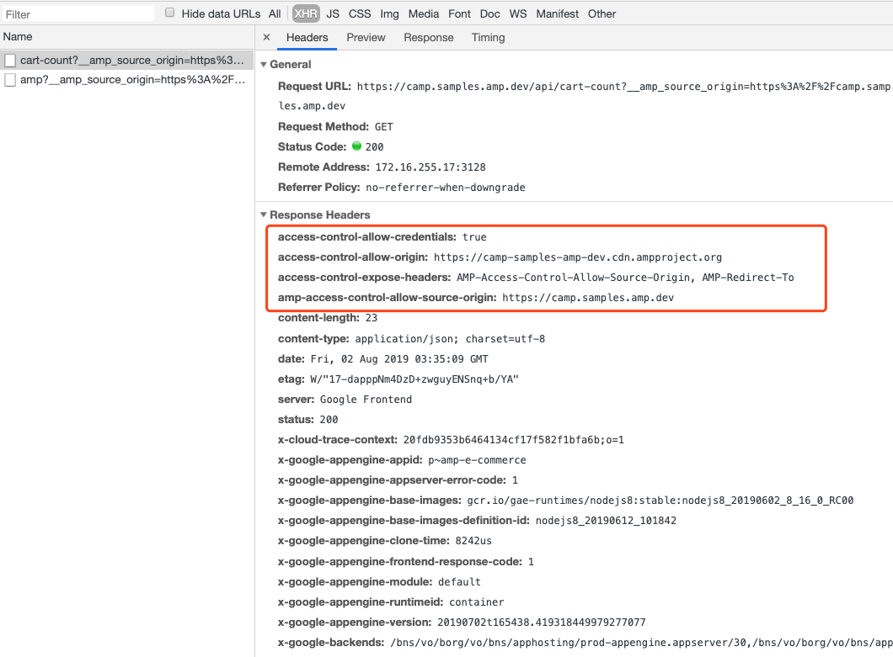
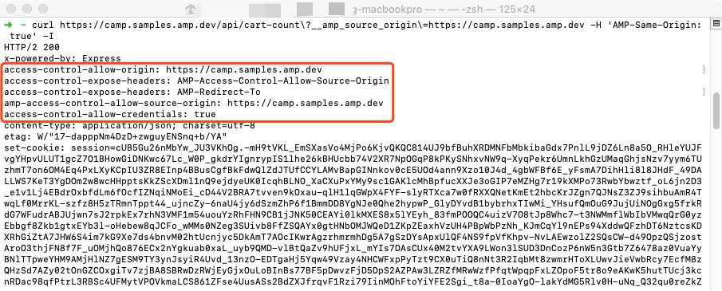
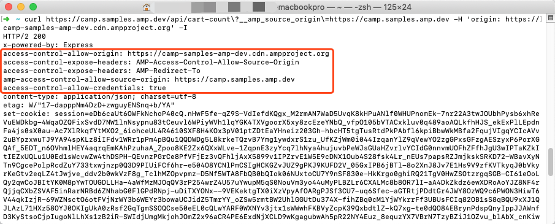

# 在AMP中实战开启CORS

我们知道，AMP里面有很多组件，例如amp-list， amp-form等组件都需要通过访问服务端的API获取数据后用以渲染数据到页面上。但在AMP中，需要开启CORS才可以保证AMP页面的正常展示。下面将展开叙述开启CORS原因和在开启CORS的实战步骤。关于CORS，你可以看[W3 CORS Spce](https://www.w3.org/TR/cors/)发布的文档进行更多了解。

## 为什么需要在我们自己的站点上开启CORS？

首先我们先来了解一下AMP组件的运行机制，例如amp-list，通过给amp-list设置src去请求服务端的API获取相应的数据进行渲染。举一个栗子🌰，假如你有一个产品列表页，上面是你的产品和价格，这个时候你想要知道最新的产品价格，所以你点击了更新价格的按钮，页面将会发出API请求一个JSON的响应。

OK，这个时候，你会发现页面产品的价格正常更新，并没有什么异常。因为，无论是页面还是API，都是来自你的域名，并不会产生任何问题。但是，在AMP中，会出现什么问题呢？





关于这个会在AMP出现什么问题，我们先来了解AMP的运作原理，我们的AMP页面在上线通过AMP验证以后，会被AMP Cache服务器复制一份副本（包括html，css以及引用的图片字体文件等等），同时分发到全世界的AMP Cache服务器中。接下来我们在打开Google输入搜索关键字得到结果的时候，会出现我们自己的站点页面结果，但这个时候我们打开的AMP页面有两种来源，一种是来自我们自己的域名，一种是来自AMP Cache的服务器。举个栗子🌰，如果来自我们站点为[https://camp.samples.amp.dev/](https://camp.samples.amp.dev/), 那么AMP Cache的站点为[https://camp-samples-amp-dev.cdn.ampproject.org/c/s/camp.samples.amp.dev/](https://camp-samples-amp-dev.cdn.ampproject.org/c/s/camp.samples.amp.dev/)。




因此当AMP Cache中的页面发送API请求的时候，因为域名不一致的原因，会产生跨域的请求，以至于AMP Cache页面无法正确获取JSON数据。因此，我们需要在服务端开启CORS的响应头。



## 开启CORS需要注意的一些事项

### 一、为CORS请求使用cookie

在AMP中有很多组件例如amp-list在使用CORS请求的时候会自动开启Credential mode或者允许开发者自行开启Credential mode。Credential Mode允许发送开发者的网站的Cookie等信息并且写入到浏览器中，等用户从AMP Cache页面跳转回开发者的站点的时候，开发者的站点便可以利用这些cookie开启个性化内容的定制，例如购物车的加车记录等等。（但受到部分浏览器如Safari对第三方Cookie的限制，并不能保证通过CORS一定能正确设定cookie，请注意这一点。）。

> ```text
> <amp-list credentials="include"
>     src="<%host%>/json/product.json?clientId=CLIENT_ID(myCookieId)">
>   <template type="amp-mustache">
>     Your personal offer: ${{price}}  </template>
> </amp-list>
> ```

### 二、确定请求的源（网域）是你想要的

通过接收Request的请求头中的Origin，我们可以知道是否我们想要通过请求的域名，一般情况下，我们应该只允许以下两种域名的请求：1.来自我们自己的域名的请求 2. 来自AMP Cache域名的请求（AMP Cache域名一般为“你的域名.cdn.ampprject.org”, 如www-google-com.cdn.ampproject.org）

### 三、如果没有Origin的Header，那就看AMP-Same-Origin的Header吧

如果在接受请求的时候没有发现Origin的Header的话，AMP会为你自动设置AMP-Same-Origin:True，也可以通过这个请求来确实是来自你自己的域名的请求。

### 四、限制确定源（网域）的请求

在发送API请求的时候，AMP会自动将"\_\_amp\_source\_origin"作为Query参数添加到你的请求中，例如"https://m.example.com/getName.json/?\_\_amp\_source\_origin=https://m.example.com"，通过检查Query参数，把请求限制在你允许的域名中。

### 五、接受请求后，一定要发送的CORS响应头。

每次在接受资源请求后，请验证Origin，并且发送相应的响应头: **Access-Control-Allow-Origin: &lt;origin&gt;,** 目前，我们推荐你在发送的响应头里面只需要包括你自己的网域以及AMP Cache的网域。例如: **Access-Control-Allow-Origin: www.example.com和Access-Control-Allow-Origin: www-example-com.cdn.ampproject.org。**

## AMP开启CORS实战

在AMP中，你有两种请求场景需要处理：

1. 来源你自己的域名的请求。
2. 来源AMP Cache站点的请求。

这两种请求可以从下图看出区别，来自AMP Cache站点的请求的域名一般为你的域名加上AMP Cache的域名，例如，你的域名为example.com，那么来自AMP Cache请求的域名为example-com.cdn.ampproject.org或者example.com.amp.cloudflare.com。

同时可以从图中看出，我们有一份article-amp.html文件存放在我们的example.com站点中，此文件已经被AMP验证通过同时复制一份副本到全球的AMP Cache服务器中。当在Google.com中搜索了example.com之后，用户可能会打开https://example.com/article-amp.html，当然也有可能打开AMP Cache上面的examle-com.cdn.ampproject.org/c/s/artice-amp.html。正常打开页面以后页面的AMP-list开始给example.com发送请求，这个时候example.com服务器就需要处理这两种来自不同域名来源的请求。



### 一、请规划好你允许的域名

了解AMP的运作机制以及开启CORS的事项后，我们推荐你可以允许以下三种请求的域名的API请求（请将example.com替换成你自己的域名。同时在Google AMP Cache中，域名的计算方法是讲“.”替换成“-”， 例如www.google.com, m.google.com会被替换成www-google-com.cdn.ampproject.org以及m-google-com.cdn.ampproject.org。）

* 你自己的域名。例如example.com
* Google AMP Cache的域名。例如example-com.cdn.ampproject.org
* CloudFlare AMP Cache的域名。例如example.com.amp.cloudflare.com

### 二、规划好准备发送的响应头\(Response Header\)

话不多说，下面的响应头就是我们想要的。我们只需要将第三个参数替换成第一步成我们想要允许的域名即可。例如你的域名是https://www.youtube.com, 那么你的AMP Cache域名就是https://www-youtube-com.cdn.ampproject.org。

```text
access-control-allow-headers: Content-Type, Content-Length, Accept-Encoding, X-CSRF-Token
access-control-allow-credentials: true
access-control-allow-origin: https://www.youtube.com
access-control-allow-methods: POST, GET, OPTIONS
access-control-expose-headers: AMP-Access-Control-Allow-Source-Origin, AMP-Redirect-To
```

```text
access-control-allow-headers: Content-Type, Content-Length, Accept-Encoding, X-CSRF-Token
access-control-allow-credentials: true
access-control-allow-origin: https://www-youtube-com.cdn.ampproject.org
access-control-allow-methods: POST, GET, OPTIONS
access-control-expose-headers: AMP-Access-Control-Allow-Source-Origin, AMP-Redirect-To
```

### 三、开启CORS吧！

关于开启CORS代码部分，我们可以通过一个函数来处理相应的请求（请理解其中的实现逻辑，并且替换成你运行的服务器代码）。下面我们将以

```text
https://camp.samples.amp.dev
```

 网站作为例子进行说明。

```text
// 在下面的函数中，我们要做三件事，
// 1. 利用query参数里面__amp_source_origin对请求的域名进行验证。
// 3. 利用请求头中的allow-same-origin为true进行验证是否满足我们的域名要求
// 2. 利用请求头中的origin对请求的域名进行验证，
// 以上三件事满足任意一件验证就通过并且返回正常响应，否则返回401未授权响应。

function assertCors(req, res, opt_validMethods, opt_exposeHeaders) {
  var unauthorized = 'Unauthorized Request';
  var origin;
  var allowedOrigins = [
     "https://camp.samples.amp.dev",
     "https://https://camp-samples-amp-dev.cdn.ampproject.org",
     "https://camp.samples.amp.dev.amp.cloudflare.com",
     "https://cdn.ampproject.org" ];
  var allowedSourceOrigin = "https://camp.samples.amp.dev";  // 我们的域名
  var sourceOrigin = req.query.__amp_source_origin; // 获取AMP为我们添加用来查询是否符合我们域名要求的参数

  // 如果amp-same-origin为true的话那么验证通过，正常响应
  if (req.headers['amp-same-origin'] == 'true') {
      origin = sourceOrigin;
      
  // 如果在origin或者__amp_source_origin中检测到我们允许的域名，验证通过，正常相应
  } else if (allowedOrigins.indexOf(req.headers.origin) != -1 &&
      sourceOrigin == allowedSourceOrigin) {
      origin = req.headers.origin;
      
  // 返回响应错误
  } else {
      res.statusCode = 401;
      res.end(JSON.stringify({message: unauthorized}));
      throw unauthorized;
  }
  // 在最后返回我们想要的响应头。
  res.setHeader('Access-Control-Allow-Credentials', 'true'); // 必要
  res.setHeader('Access-Control-Allow-Origin', origin); // 必要
  res.setHeader('Access-Control-Allow-Headers', 'Content-Type, Content-Length, Accept-Encoding, X-CSRF-Token'); // 非必要
  res.setHeader('access-control-allow-methods', 'POST, GET, OPTIONS'); // 非必要
  res.setHeader('Cache-Control', 'private, no-cache'); // 非必要
  res.setHeader('Access-Control-Expose-Headers', 'AMP-Access-Control-Allow-Source-Origin, AMP-Redirect-To'); // 非必要
}
```

在生产环境中，我们应该是会看到以下结果：





## 在AMP完成开启CORS了，来测试是否正常开启

在完成了响应的响应代码编写以后，我们可以使用curl命令来验证我们的网站是否正确开启CORS。（以[https://camp.samples.amp.de](https://camp.samples.amp.dev/)/作为例子， 请直接复制其中的代码到你的命令行执行。）

### 一、验证我们自己的域名是否正确CORS：

```text
curl https://camp.samples.amp.dev/api/cart-count\?__amp_source_origin\=https://camp.samples.amp.dev -H 'AMP-Same-Origin: true' -I
```



### 二、验证AMP Cache域名是否正确开启CORS:

```text
curl https://camp.samples.amp.dev/api/cart-count\?__amp_source_origin\=https://camp.samples.amp.dev -H 'origin: https://camp-samples-amp-dev.cdn.ampproject.org' -I
```



如果能正确出现上述两种结果，那么恭喜你，你正确在AMP中打开了CORS！有更多的问题，请查看[Cors in AMP](https://amp.dev/documentation/guides-and-tutorials/learn/amp-caches-and-cors/amp-cors-requests/?format=websites)。

