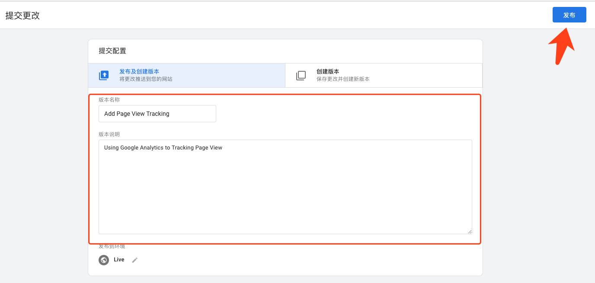

# 如何通过Google Tag Manager配置Google Analytics以追踪AMP？

### 一、如何在GTM中配置GA

#### 1. 创建一个新的container

```text
创建一个新的账户(Account)并且配置容器(Container)，同时选择目标广告平台(Target Platform)为AMP。
```


#### 2. 安装跟踪代码

```text
容器(Container)完成初始化后需要安装Google跟踪代码管理器，请将代码粘贴到站点指定位置处。
```


#### 3. 新建代码\(Tags\)

```text
新建代码(Tags)，选择Google Analytics（分析）: Universal Analytics，输入跟踪ID,创建成功后可在代码(Tags)中看见新建的代码。
```


#### 4. 发布容器\(Container\)开始追踪数据

```text
点击提交(Submit)，填写相应的版本名称和说明，点击发布(Publish)，此时可以重新刷新你的页面，并且到Google Analytics查看相应的数据。
```




### 二、查看数据是否正确Tracking

#### 1. 第一种方式

```text
第一种方式直接到Google Analytics中点击“实时” - “概览”中查看是否正确统计。
```


#### 2.第二种方式

```text
第二种方式从Chrome开发者工具查看有关于collect的请求是否正确请求(此请求是Google Analytics专门用于统计数据的接口，一般会请求一次到两次，以最后的请求返回200为正确请求成功，即数据追踪成功。其中第二次请求的域名一般为https://stats.g.doubleclick.net)。
```

> 请注意，如果您在Google Analytics中开启了再营销功能，那么您可能会看到多个302的Tracking请求，但这不影响您的Google Analytics进行正确的数据统计。


### 三、引用资源

* [GTM guide](https://support.google.com/tagmanager/answer/6103696)
* [Supported Platforms](https://www.ampproject.org/support/faqs/supported-platforms)
* [Vendors and Partners](https://www.ampproject.org/support/faqs/supported-platforms)

