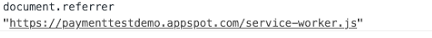

#Push & Notification系列
问题列表： 

* [想要快速入门Push & Notification,有什么推荐？](#想要快速入门Push和Notification有什么推荐)
* [如果想要展示Notification需要注意些什么？](#如果想要展示notification需要注意些什么)
* [想要获取Notification权限有什么比较可行的方式？](#想要获取notification权限有什么比较可行的方式)
* [点击Notification跳转到新的页面的referrer指向的是?](#点击notification跳转到新的页面的referrer指向的是)
* [开发的时候给Notification设置了ask权限，但是刷新页面后读取还是denied？](#开发的时候给notification设置了ask权限但是刷新页面后读取还是denied)

##想要快速入门Push和Notification有什么推荐

没有什么比Coding更容易理解了，可以学习[向网络应用添加推送通知](https://developers.google.com/web/fundamentals/codelabs/push-notifications/)这篇文章快速入手。

同时后端也需要进行消息的推送，关于消息推送，可以参考使用[Web Push Libraries进行消息推送](https://developers.google.com/web/fundamentals/push-notifications/sending-messages-with-web-push-libraries)。

如果想更方便简洁的开发Push Notification，我们强烈建议使用[Firebase Cloud Messaging](https://firebase.google.com/docs/cloud-messaging/js/client).

蛮不错的其他参考资源：[Web Push Book](https://web-push-book.gauntface.com/)

##如果想要展示Notification需要注意些什么

如果想要展示Notification需要获取权限，同时需要用户点击同意后调用回调函数处理即可。但是一定要注意的一点是，请求Notification只有一次机会， 如果用户点击了不同意的按钮，那么将永久没有办法进行Notification。建议根据[权限请求设计建议](https://developers.google.com/web/fundamentals/push-notifications/permission-ux)设计来控制自己的请求权限的时间还有条件。

可参考[Notification如何请求通知权限](https://developers.google.com/web/fundamentals/push-notifications/subscribing-a-user#requesting_permission)。

##想要获取Notification权限有什么比较可行的方式

A. 如果是需要请求权限，可使用[RequestPermission](https://developer.mozilla.org/en-US/docs/Web/API/Notification/requestPermission)。

B. 如果仅仅是查询权限，可使用[Notification.permission](https://developer.mozilla.org/en-US/docs/Web/API/Notification/permission)和[navigator.permission.query({name: 'notifications'}).then()](https://developer.mozilla.org/en-US/docs/Web/API/Permissions/query)。

##点击Notification跳转到新的页面的referrer指向的是
指向的是service-worker的地址，可参考下图console示例。

##开发的时候给Notification设置了ask权限但是刷新页面后读取还是denied
关闭页面重新打开即可，有时直接刷新页面状态读取的状态可能仍未更新。