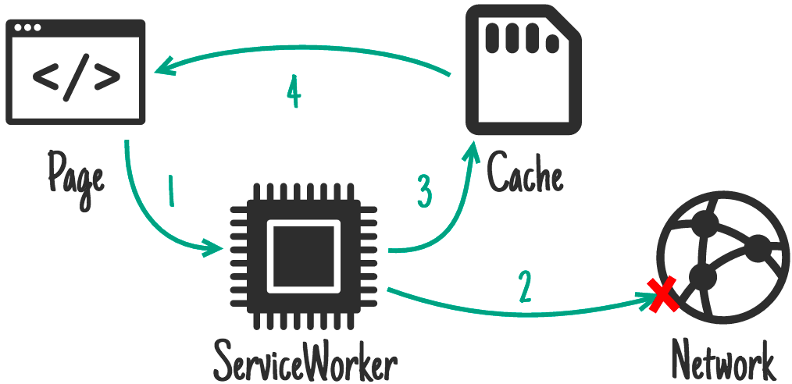

##资源实时更新，但是我也想在网络不好的时候能够读返回一个旧点的页面？{#network-first}

A: Network First（网络优先策略），很多资源我们想从服务器拿到最新的资源，但是我们也想要说网络状态不好的时候我们也能返回一个相对旧的Cache资源，这样也能保证用户正常的访问体验。

**简单来说**: 假如我们有宝宝了，宝宝要吃国外的奶粉（指的就是资源），这个时候因为奶粉快吃完了，国外的又不能及时到国内，但是我们可以从在国内的淘宝上买到国外的奶粉，虽然可能存放了有一定时间，但是至少能够保证宝宝能吃到。

**适用场景**: 新闻页，电商的活动页等实时性要求高的页面。