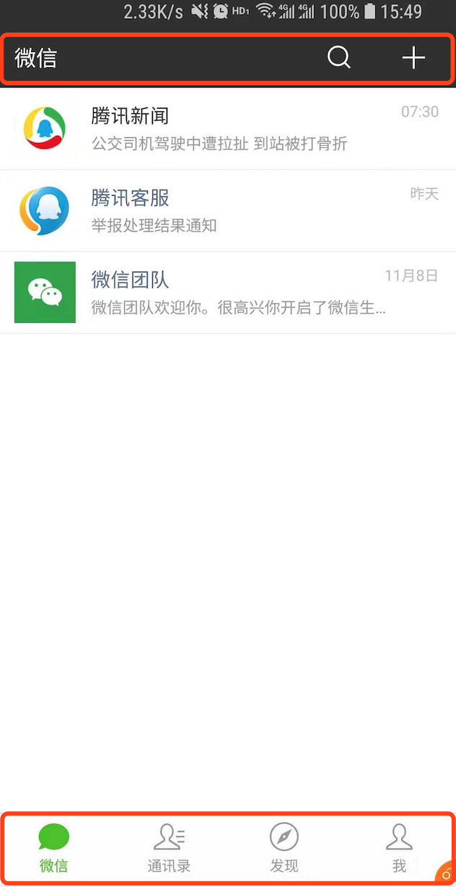

##[APP Shell](https://developers.google.com/web/updates/2015/11/app-shell)（应用外壳）如何选择缓存策略？{#precache}

A: Precache（预缓存策略），即在安装SW触发[Install](https://developers.google.com/web/fundamentals/primers/service-workers/lifecycle#install) 事件时缓存APP shell，这样就能保证一旦SW进入激活（Activate）状态后，再次刷新页面即可返回APP shell的文件。

**简单来说**: APP Shell如我们的微信聊天界面中标红的上边的状态栏，下边的tab菜单，无论中间的内容怎么变化，而上下的部分是不变的，这上下部分就是APP Shell。一般App Shell仅包含index.html以及inline的样式， 但也可以根据业务场景调整。

适用场景： index.html以及电商频道主页，例如电子产品主页，服装产品主页。