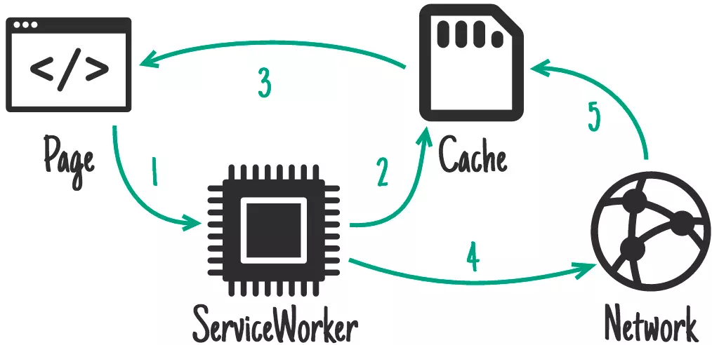

##想先从Cache返回旧的资源，同时我也想要把Cache中的资源更新一遍，怎么做？{#stale-while-revalidate}

A: StaleWhileRevalidate(陈旧，同时也要更新策略)，这个是我自己翻译的哈，听起来有点不太好理解。实际上这个策略是这样执行的，请求资源的时候先返回Cache中的资源，但是同时SW也会去服务器请求新的版本更新这个资源，这样虽然返回的是一个旧版本的资源，但是能保证下一次使用的时候是更新过的。

假如我们买了个小电驴，但是电池（指的就是资源）用的有点旧了，车子勉强能上路，同时今天喊了妈妈要记得帮忙买新的电池，晚上再换上，明天就能继续上路了啊。

**适用场景**: 用户头像，CDN或者第三方引用的会有一定变更的资源。