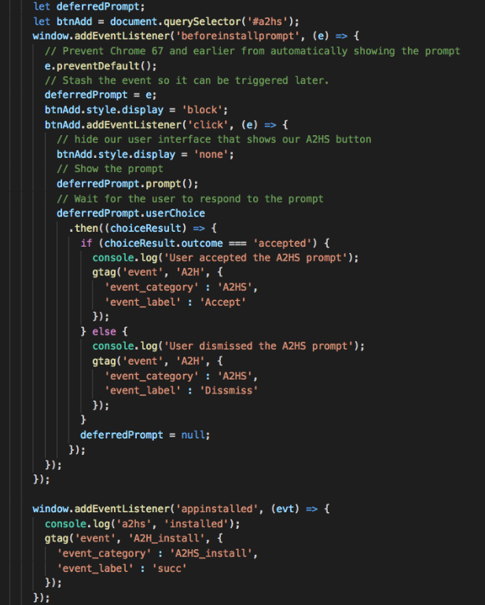

#PWA开发Q&A

##PWA生命周期系列

## Add to HomeScreen系列

#### 1. 如何追踪PWA正确安装到主屏幕上了？？

A. [beforeinstallprompt](https://developer.mozilla.org/zh-CN/docs/Web/API/BeforeInstallPromptEvent)事件可以帮助我们追踪用户是否愿意添加到主屏幕, 可以参考[网网络应用横幅事件](https://developers.google.com/web/fundamentals/app-install-banners/?hl=zh-cn#_2)。

B. [appinstalled](https://developer.mozilla.org/en-US/docs/Web/Events/appinstalled)事件可以帮助我们追踪PWA是否正确安装到主屏幕中, 可以参考下图。

C. 附上一遍写的比较好的文章: [Tracking PWA events with Google Analytics](https://docs.google.com/document/d/15rTCnqWgzmvbjabY4uB_c9_Kox3QGRXs1xtR8Ghp1FE/edit)

## WEB APP Manifest系列

#### 1.添加到主屏幕后，如何追踪是从打开主屏幕的数据？
可以在Manifest中start_url中url添加query参数，如?launcher=true. https://developers.google.com/web/fundamentals/web-app-manifest/#start-url

##Notification系列
#### 1.想要获取Notification权限，有什么比较可行的方式？

A. 如果是需要请求权限，可使用[RequestPermission](https://developer.mozilla.org/en-US/docs/Web/API/Notification/requestPermission)。

B. 如果仅仅是查询权限，可使用[Notification.permission](https://developer.mozilla.org/en-US/docs/Web/API/Notification/permission)和[navigator.permission.query({name: 'notifications'}).then()](https://developer.mozilla.org/en-US/docs/Web/API/Permissions/query)。

##GA系列

#### 1.没有使用任何第三方框架下，原生代码实现的PWA如何实现GA数据的跟踪？

PWA即使在离线情况也能提供良好的用户体验，那么，我们这里有两个问题要解决。

A.PWA中生命周期中发生的事件怎么追踪，如notificationclose等事件，可以参考[怎么集成GA在PWA](https://developers.google.com/web/ilt/pwa/integrating-analytics)。

B.离线状态下网站也会有GA的数据追踪请求，那么可以参考[PWA离线数据追踪](https://developers.google.com/web/ilt/pwa/integrating-analytics#offline_analytics), 教程里面用到了[sw-offline-google-analytics](https://developers.google.com/web/updates/2016/07/offline-google-analytics.https://www.npmjs.com/package/sw-offline-google-analytics)这个库，非常简单易用。 

#### 2. 基于workbox开发的PWA如何在离线状态控制GA的数据追踪？

[Workbox](https://developers.google.com/web/tools/workbox/)是Google为了降低开发PWA开发成本提供的一个JS库，使用这个库追踪GA请求非常简单，只需要调用workbox.googleAnalytics.initialize()就ok了，可参考[Workbox Google Analytics](https://developers.google.com/web/tools/workbox/modules/workbox-google-analytics).

PS: Workbox Google Analytics是基于[Background Sync](https://wicg.github.io/BackgroundSync/spec/)的，因此能确保GA的hit在网络恢复时能即时恢复请求。

