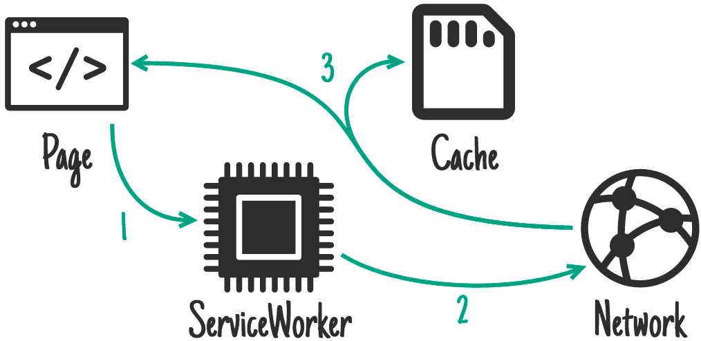

#缓存策略の选择

[PWA](https://developers.google.com/web/progressive-web-apps/)基于Service Worker（以下简称SW）以及Cache API的结合，离线情况下也能提供良好的用户体验。但是，我们有多种业务场景的情况下，该如何抉择缓存策略呢？

#### 1. [APP Shell](https://developers.google.com/web/updates/2015/11/app-shell)（应用外壳）如何选择缓存策略？

A: Precache（预缓存策略），即在安装SW触发[Install](https://developers.google.com/web/fundamentals/primers/service-workers/lifecycle#install) 事件时缓存APP shell，这样就能保证一旦SW进入激活（Activate）状态后，再次刷新页面即可返回APP shell的文件。

**简单来说**: APP Shell如我们的微信聊天界面中标红的上边的状态栏，下边的tab菜单，无论中间的内容怎么变化，而上下的部分是不变的，这上下部分就是APP Shell。一般App Shell仅包含index.html以及inline的样式， 但也可以根据业务场景调整。

适用场景： index.html以及电商频道主页，例如电子产品主页，服装产品主页。

#### 2. 不常变动的文件但常用的CSS或者JS文件，该怎么选择缓存策略？

A: Cache First(缓存优先策略)，当浏览器发送请求时，SW会拦截请求，这个时候如果将内容提前缓存到浏览器的Cache中，那么SW即可实时读取并且返回内容，如果读取不到，SW将会从网络中请求资源，那么对于用户体验来讲是极好的。

**简单来说**: 我们在亚马逊海外购上面购买的部分海外商品（指的就是资源），仅仅需要两三天就到了，为什么呢？因为亚马逊已经提前将海外的商品购入并且存放在国内的库房里面，所以，给我们的感觉就像是买的是国内的东西，而不是要等一段时间才到的东西。

**适用场景**：不常变动但较常用的文件，例如icon，CSS框架以及JS框架。

#### 3. 资源实时更新，但是我也想在网络不好的时候能够读返回一个旧点的页面？

A: Network First（网络优先策略），很多资源我们想从服务器拿到最新的资源，但是我们也想要说网络状态不好的时候我们也能返回一个相对旧的Cache资源，这样也能保证用户正常的访问体验。

**简单来说**: 假如我们有宝宝了，宝宝要吃国外的奶粉（指的就是资源），这个时候因为奶粉快吃完了，国外的又不能及时到国内，但是我们可以从在国内的淘宝上买到国外的奶粉，虽然可能存放了有一定时间，但是至少能够保证宝宝能吃到。

**适用场景**: 新闻页，电商的活动页等实时性要求高的页面。

#### 4. 想先从Cache返回旧的资源，同时我也想要把Cache中的资源更新一遍，怎么做？

A: StaleWhileRevalidate(陈旧，同时也要更新策略)，这个是我自己翻译的哈，听起来有点不太好理解。实际上这个策略是这样执行的，请求资源的时候先返回Cache中的资源，但是同时SW也会去服务器请求新的版本更新这个资源，这样虽然返回的是一个旧版本的资源，但是能保证下一次使用的时候是更新过的。

**简单来说**: 我们买了个小电驴，但是电池（指的就是资源）用的有点旧了，车子勉强能上路，同时今天喊了妈妈要记得帮忙买新的电池，晚上再换上，明天就能继续上路了啊。

**适用场景**: 用户头像，CDN或者第三方引用的会有一定变更的资源。

#### 5. 只想从Cache返回资源，其他不需要，怎么做？

A: （不推荐）Cache Only(仅缓存策略)，浏览器发起请求，SW只适用缓存的资源返回响应，假如请求失败则不做任何操作。

**简单来说**: 买了一瓶沐浴液（指的就是资源），每天用一点点，但是万一有一天用完了也不去买新的，不就很尴尬了吗？

**适用场景**: 基本不更新的资源。

#### **Q**: 只想从请求并拿取网络中的最新资源，怎么做？

A: Network Only（仅网络策略），所有的请求跟正常网络请求一样，SW不会进行拦截，服务器怎么返回，SW就怎么返回。

**简单来说**: 这个不用说了吧，因为SW这里是不作为的，无论请求什么，SW都不做任何操作，就直接让请求到服务器了。

**适用场景**: 购物车，结算页等实时性要求非常高的页面。

